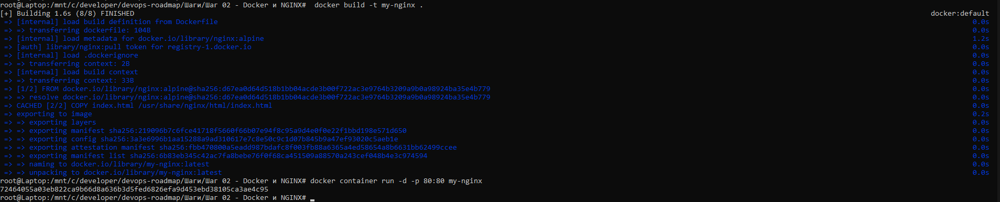
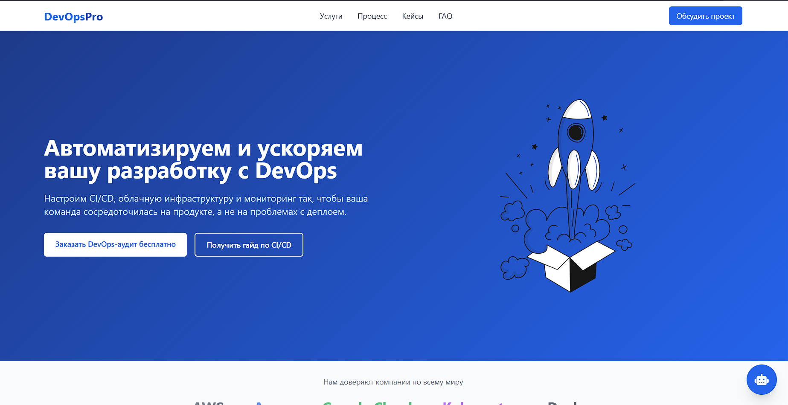
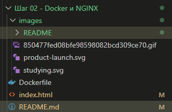

## 🐳 Шаг 02 — Docker и NGINX

### 📖 Что изучал

* Видео: Docker — основы контейнеров ([ссылка](https://www.youtube.com/watch?v=Kyx2PsuwomE))
* Гайд: Get Started with Docker ([ссылка](https://docs.docker.com/get-started/get-docker/))

### 🛠 Что сделал

* Установил Docker
* Написал `Dockerfile` для запуска NGINX
* Собрал образ:

  ```bash
  docker build -t my-nginx .
  ```
* Запустил контейнер:

  ```bash
  docker run -d -p 80:80 my-nginx
  ```
* Проверил работу в браузере: `http://localhost:80`

### 📸 Скриншоты

1. Вывод `docker ps`

   
2. Страница в браузере

   
3. Структура проекта в VS Code

   

### 💡 Комментарии / выводы

* Понял разницу между образом и контейнером
* Контейнер изолирует приложение, и это удобно
* NGINX — отличный пример "готового сервиса"
* все содержимое копируется в nginx/html командой
  docker container run -d -p 80:80 -v $(pwd):/usr/share/nginx/html --name nginx-website nginx и потом можно просто в vs code создавать проект он сразу будет обновляться в localhost.
* собрать образ docker build -t mynginx .
* запуск docker container run -d -p 80:80 mynginx
