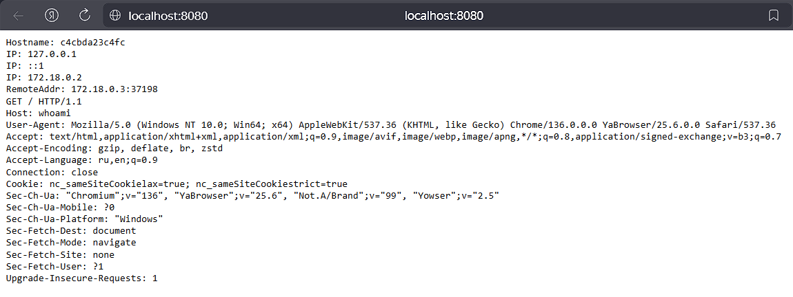
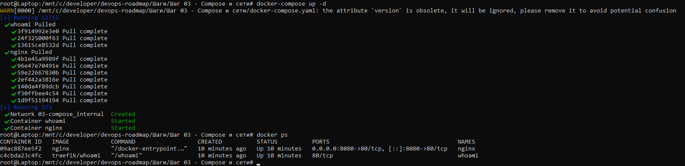
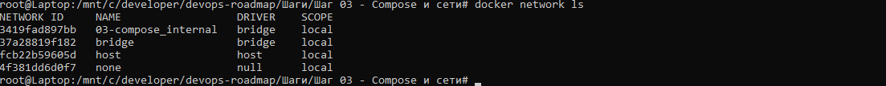
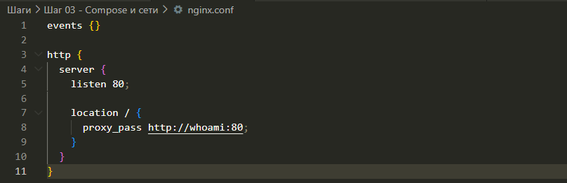

## 🪜 Шаг 03 — Docker Compose и внутренняя сеть

## 📖 Что изучил (простыми словами):

### 🧩 1. Как работает `docker-compose` и его структура (services, volumes, networks)

`docker-compose` — это инструмент, который позволяет **запускать сразу несколько контейнеров** из одного файла (`docker-compose.yml`).

В этом файле ты описываешь:

* `services`: какие контейнеры запускать (например, `nginx`, `postgres`, `backend`, `frontend`)
* `volumes`: какие папки или файлы нужно подключить внутрь контейнеров
* `networks`: как соединить контейнеры друг с другом (по умолчанию — одна общая сеть)

👉 Вместо множества команд ты запускаешь всё **одной**:

```bash
docker-compose up -d
```

### 🧱 2. Что такое многоконтейнерная конфигурация и зачем она нужна

Многоконтейнерная конфигурация — это когда твой проект состоит из **нескольких сервисов**, и каждый из них работает в своём контейнере.

Пример:

* Контейнер 1: `nginx` (обрабатывает входящие запросы)
* Контейнер 2: `whoami` (отвечает на запросы и показывает информацию)
* Контейнер 3: `postgres` (база данных)

Зачем это нужно:

* Разделение ответственности: каждый контейнер делает только своё дело
* Удобно управлять: можно перезапустить только нужную часть
* Гибкость и масштабируемость: можно менять компоненты по отдельности

### 🌐 3. Разница между `default` и `custom` сетями в Docker

Docker сам создаёт **сеть по умолчанию**, если ты не указал свою. Контейнеры в этой сети **видят друг друга по имени сервиса** (например, `nginx` может обратиться к `whoami` просто по имени `whoami`).

Но часто лучше создавать **свою (custom)** сеть — так ты:

* Даёшь ей понятное имя
* Лучше контролируешь, кто с кем может взаимодействовать
* Избегаешь конфликтов при масштабировании

Пример:

```yaml
networks:
  my_network:
```

### 🔁 4. Как использовать NGINX как reverse proxy к другому контейнеру (`whoami`)

**NGINX** — это веб-сервер, но его можно использовать как **обратный прокси (reverse proxy)**.

Это значит:

* Пользователь приходит по адресу `localhost`
* NGINX получает этот запрос
* NGINX пересылает его во **второй контейнер** — `whoami`
* Ответ возвращается через NGINX пользователю

Всё это происходит **внутри Docker-сети**, и `nginx.conf` настраивает это перенаправление.

### 🔍 5. Как работает взаимодействие контейнеров через имя сервиса (DNS внутри Docker-сети)

Когда ты используешь `docker-compose`, каждый сервис (контейнер) **доступен по своему имени** — так работает встроенный DNS в Docker.

Пример:

```nginx
proxy_pass http://whoami:80;
```

Это значит: **перенаправь трафик на контейнер с именем `whoami`**, который слушает порт 80.

Не нужно прописывать IP-адрес — Docker сам внутри сети всё настроит.

## 🛠 Что сделал:

* Создал `docker-compose.yml` с двумя сервисами:
  * `nginx`
  * `whoami` (сервис, показывающий IP и заголовки запроса)
* Настроил `nginx.conf`, чтобы проксировать трафик с `/` на сервис `whoami`
* Поднял конфигурацию одной командой:

```bash
docker-compose up -d
```

Проверил в браузере и убедился, что работает проксирование через NGINX

## 🧾 Полезные команды:

```bash
docker-compose up -d             # Запуск всех сервисов
docker-compose ps                # Список работающих контейнеров
docker-compose logs nginx        # Логи nginx
docker network ls                # Список сетей Docker
docker network inspect <имя_сети>  # Подробности о конкретной сети
docker exec -it <имя_контейнера> sh  # Зайти внутрь контейнера
```

## 📸 Скриншоты:

✅ Скрин браузера, где видно ответ от `whoami` через `nginx`



✅ Скрин команды `docker ps` — 2 контейнера работают



✅ Скрин `docker network ls` с созданной пользовательской сетью



✅ Скрин фрагмента `nginx.conf`


